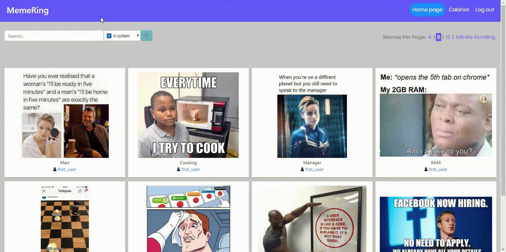

## MemeRing
This project represents web application for uploading memes. It includes the front-end part, made using technologies jQuery, JavaScript, HTML and CSS. Back-end part represents REST API, made using C#.

Tests performed using technology xUnit.net.

### Prerequisites
You will need:
- entity framework core. To install, run in PowerShell:
```
 dotnet tool install --global dotnet-ef --version 3.0.0
```
- MS SQL Server 
- Microsoft .NET Core SDK 2.2 and more

### Installation

1. Clone the repository:
  
```
 git clone --recursive https://github.com/BKarabadzhak/MemeRing.git
```
2. Created database for this project

3. Find file appsettings.json and change connection string to your database

4. Create migration in project folder with commands in PowerShell:
```
 dotnet ef migrations add "name_of_migration"
```
```
 dotnet database update
```

5. Run .sln file and open Register.html

### Example
Using the following example when accessing API on route http://localhost:5000/api/Photos/Description you will get as response a collection of pagination images by their description and total number of pages:
```json
{
  "Description": "Some_description",
  "PageSize": "8",
  "PageNumber": "1"
}
```

### Usage
Main User Interface features:

- Registration new user, logout and login:


- Add and open new image:



- Update description and delete image:


- Move to another user’s page and try pagination mode:


- Try infinite scroll mode:


- Search on the Home page in whole system and in the Cabinet on the page:


